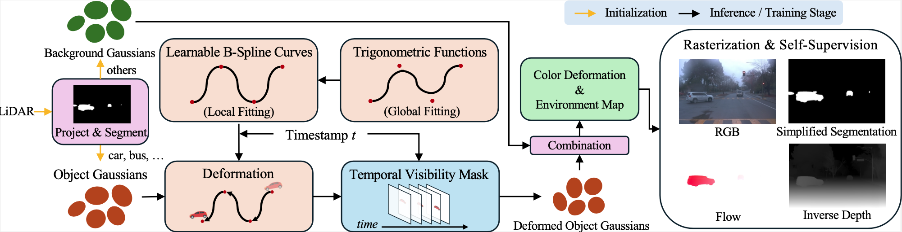

# AD-GS: Object-Aware B-Spline Gaussian Splatting for Self-Supervised Autonomous Driving
[ICCV 2025] Official implementation of "AD-GS: Object-Aware B-Spline Gaussian Splatting for Self-Supervised Autonomous Driving"



## Preparation

### Install

```shell
git clone https://github.com/JiaweiXu8/AD-GS.git
cd AD-GS

conda env create -f environment.yaml
conda activate AD-GS
pip install "git+https://github.com/facebookresearch/pytorch3d.git"  # install pytorch3d

# require CUDA 11.X
pip install -e ./submodules/simple-knn
pip install -e ./submodules/depth-diff-gaussian-rasterization
```

*If you have already installed colmap. You can remove the colmap installization in environment.yaml.*

### Monocular Depth Prior

We use [DPTv2](https://github.com/DepthAnything/Depth-Anything-V2) (Depth-Anything-V2-Large model) to get the monocular depth prior. In our paper, we create a new environment and follow the instructions from DPTv2 to prepare this model.

```shell
git clone https://github.com/DepthAnything/Depth-Anything-V2
cp ./scripts/run-dpt.py ./Depth-Anything-V2/
cd Depth-Anything-V2
conda create -n dpt python=3.11.0
conda activate dpt
pip install -r requirements.txt

# download checkpoints: Depth-Anything-V2-Large
mkdir checkpoints
cd checkpoints
wget https://huggingface.co/depth-anything/Depth-Anything-V2-Large/resolve/main/depth_anything_v2_vitl.pth?download=true

# back to the original folder and environment
cd ../../
conda activate AD-GS
```

### Semantic Segmentation

We use [Grounded-SAM-2](https://github.com/IDEA-Research/Grounded-SAM-2?tab=readme-ov-file) to get the semantic segmentation prior. The segmentation provides the position of each possible dynamic objects on the image. In our paper, we create a new environment and run the following instructions to prepare this model.
```shell
git clone https://github.com/IDEA-Research/Grounded-SAM-2.git
cp ./scripts/semantic.py ./Grounded-SAM-2/
cd Grounded-SAM-2
conda create -n sam python=3.10
conda activate sam
pip install torch torchvision torchaudio
export CUDA_HOME=/path/to/cuda-12.1/
pip install -e .
pip install --no-build-isolation -e grounding_dino

# download checkpoints
cd checkpoints
bash download_ckpts.sh
cd ../gdino_checkpoints
bash download_ckpts.sh

# back to the original folder and environment
cd ../../
conda activate AD-GS
```

*Notice: You may need to add ".png" and ".PNG" to Line 315 in Grounded-SAM-2/sam/utils/misc.py*

### Others

+ We use [Co-Tracker3](https://cotracker3.github.io/) to generate optical flow pseudo labels, and we load the pretrained model through ```torch.hub```.
+ We use ColMap to generate SfM points. If you have several problems in installing ColMap, just try to use conda ```conda install colmap=3.7 -c conda-forge```.

### Datasets

<details>

<summary>KITTI-MOT</summary>

#### Preprocess

Download the dataset [Here](https://www.cvlibs.net/datasets/kitti/eval_tracking.php), including Left/Right images, GPS/IMU data, Camera calibration files, Velodyne Point Clouds. The data structure should be like

```
kitti
|-- data_tracking_calib
|-- data_tracking_image_2
|-- data_tracking_image_3
|-- data_tracking_label_2
|-- data_tracking_oxts
`-- data_tracking_velodyne
```

Use the following instruction to preprocess the dataset.

```shell
bash scripts/kitti/prepare-kitti.sh <path to kitti>
```

#### Pseudo Labels

Generate priors in depth, object&sky mask, optical flow, and SfM. Segment pointcloud based on the object masks.

```shell
# monocular depth prior.
conda activate dpt
cd Depth-Anything-V2
python run-dpt.py --img-path ../data/kitti/<0001, 0002, 0006>/image --outdir ../data/kitti/<0001, 0002, 0006>/depth
cd ..

# object & sky mask.
conda activate sam
cd Grounded-SAM-2
python semantic.py ../data/kitti/<0001, 0002, 0006> --text sky. --name sky
python semantic.py ../data/kitti/<0001, 0002, 0006> --text car.bus.truck.van.human. --name semantic
cd ..

# segment pcd based on the object masks
conda activate AD-GS
bash scripts/kitti/segment-pcd.sh

# optical flow
bash scripts/kitti/prepare-flow.sh

# colmap
bash scripts/kitti/prepare-colmap.sh
```

</details>

<details>

<summary>Waymo</summary>

Download the dataset [Here](https://console.cloud.google.com/storage/browser/waymo_open_dataset_v_1_4_1/individual_files?pageState=(%22StorageObjectListTable%22:(%22f%22:%22%255B%255D%22))), and the data structure should be like

```
waymo
|-- individual_files_validation_segment-10448102132863604198_472_000_492_000_with_camera_labels.tfrecord  # scene006
|-- individual_files_validation_segment-12374656037744638388_1412_711_1432_711_with_camera_labels.tfrecord  # scene026
|-- individual_files_validation_segment-17612470202990834368_2800_000_2820_000_with_camera_labels.tfrecord  # scene090
|-- individual_files_validation_segment-1906113358876584689_1359_560_1379_560_with_camera_labels.tfrecord  # scene105
|-- individual_files_validation_segment-2094681306939952000_2972_300_2992_300_with_camera_labels.tfrecord  # scene108
|-- individual_files_validation_segment-4246537812751004276_1560_000_1580_000_with_camera_labels.tfrecord  # scene134
|-- individual_files_validation_segment-5372281728627437618_2005_000_2025_000_with_camera_labels.tfrecord  # scene150
`-- individual_files_validation_segment-8398516118967750070_3958_000_3978_000_with_camera_labels.tfrecord  # scene181
```

We use the eight scenes selected by [StreetGS](https://github.com/zju3dv/street_gaussians). Use the following instruction to preprocess the dataset.

```shell
 # install waymo utils
pip install tensorflow==2.11.0
pip install waymo-open-dataset-tf-2-11-0==1.6.1 --no-dependencies

# preprocess
bash scripts/waymo/prepare-waymo.sh <path to waymo>
```

#### Pseudo Labels

Generate priors in depth, object&sky mask, optical flow, and SfM. Segment pointcloud based on the object masks.

```shell
# monocular depth prior.
conda activate dpt
cd Depth-Anything-V2
python run-dpt.py --img-path ../data/waymo/sceneXXX/image --outdir ../data/waymo/sceneXXX/depth
cd ..

# object & sky mask.
conda activate sam
cd Grounded-SAM-2
python semantic.py ../data/waymo/sceneXXX --text sky. --name sky
python semantic.py ../data/waymo/sceneXXX --text car.bus.truck.van.human. --name semantic
cd ..

# segment pcd based on the object masks
conda activate AD-GS
bash scripts/waymo/segment-pcd.sh

# optical flow
bash scripts/waymo/prepare-flow.sh

# colmap
bash scripts/waymo/prepare-colmap.sh
```

</details>


<details>

<summary>nuScenes</summary>

#### Preprocess

Download the dataset [Here](https://www.nuscenes.org/nuscenes#data-collection), and the data structure should be like

```
nuScenes
|-- can_bus
|-- info
|-- lidarseg
|-- maps
|-- mini
|-- nuscenes_test
|-- samples
|-- sweeps
|-- tar
|-- test
|-- v1.0-test
`-- v1.0-trainval
```

We use the 10 to 69(inclusive) frames of scene 0230, 0242, 0255, 0295, 0518 and 0749. Use the following instruction to preprocess the dataset.

```shell
bash scripts/nuscene/prepare-nuscenes.sh <path to nuScenes>
```

#### Pseudo Labels

Generate priors in depth, object&sky mask, optical flow, and SfM. Segment pointcloud based on the object masks.

```shell
# monocular depth prior.
conda activate dpt
cd Depth-Anything-V2
python run-dpt.py --img-path ../data/nuscenes/sceneXXX/image --outdir ../data/nuscenes/sceneXXX/depth
cd ..

# object & sky mask.
conda activate sam
cd Grounded-SAM-2
python semantic.py ../data/nuscenes/sceneXXX --text sky. --name sky
python semantic.py ../data/nuscenes/sceneXXX --text car.bus.truck.van.human.bike. --name semantic
cd ..

# segment pcd based on the object masks
conda activate AD-GS
bash scripts/nuscenes/segment-pcd.sh

# optical flow
bash scripts/nuscenes/prepare-flow.sh

# colmap
bash scripts/nuscenes/prepare-colmap.sh
```

</details>

## Run

Use the scripts to train and evaluate our model.

```shell
# kitti
bash scripts/kitti/run-kitti.sh cuda:0

# waymo
bash scripts/waymo/run-waymo.sh cuda:0

# nuscenes
bash scripts/nuscene/run-nuscenes.sh cuda:0

# The first parameter means the device ID.
```
The results can be found in ```./output```.

## Acknowledgments

This framework is adapted from [Gaussian Splatting](https://repo-sam.inria.fr/fungraph/3d-gaussian-splatting/). We also thank [DPTv2](https://github.com/DepthAnything/Depth-Anything-V2), [Grounded-SAM-2](https://github.com/IDEA-Research/Grounded-SAM-2?tab=readme-ov-file) and [Co-Tracker3](https://cotracker3.github.io/) for their great works.

## BibTex

```
@article{xu2025adgs,
    title={{AD-GS}: Object-Aware {B-Spline} {Gaussian} Splatting for Self-Supervised Autonomous Driving},
    author={Jiawei, Xu and Kai, Deng and Zexin, Fan and Shenlong, Wang and Jian, Yang and Jin, Xie},
    journal={International Conference on Computer Vision},
    year={2025},
}
```